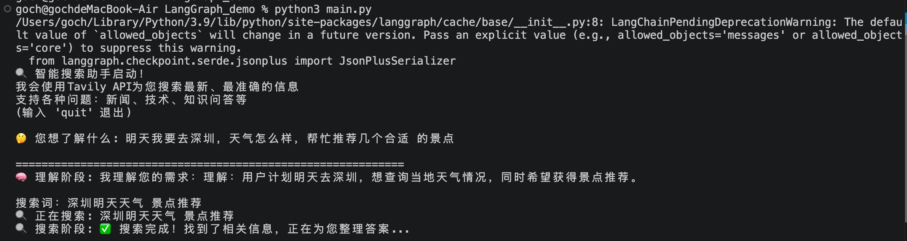
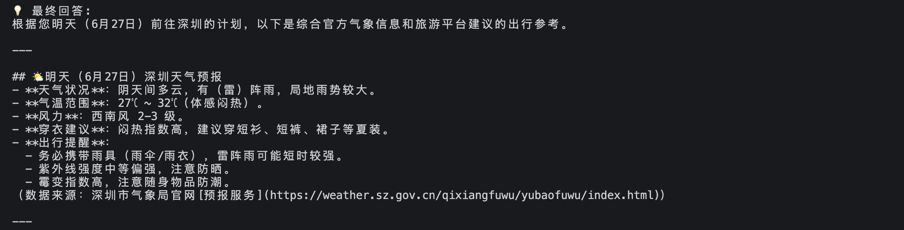
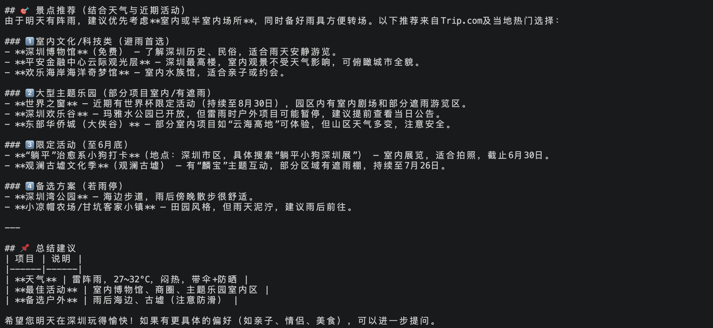

# Introduction
A simple code demo about ‘LangGraph’, based on the chapter-6 of the [[hello-agents]](https://github.com/datawhalechina/hello-agents) project.

# Usage
```bash
python main.py 
```

<div align=center>



</div>