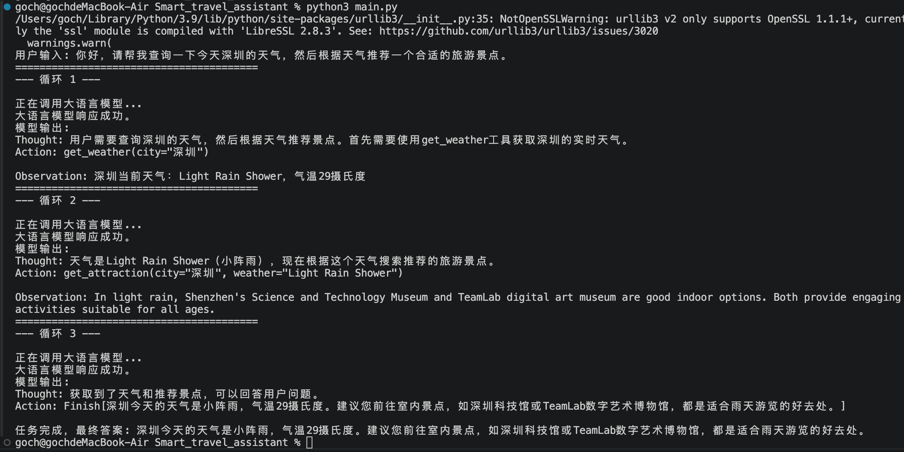
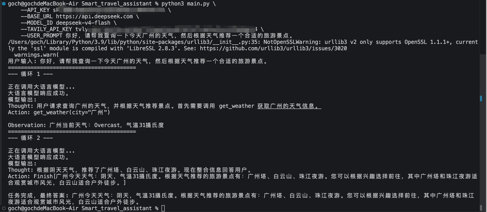

# Introduction
A simple code demo about ‘Smart travel assistant’, based on the chapter-1 of the [[hello-agents]](https://github.com/datawhalechina/hello-agents) project.

# Usage
```bash
python main.py \
--API_KEY <your api key> \
--BASE_URL <your base url> \
--MODEL_ID <your model id> \
--TAVILY_API_KEY <your tavily api key> \
--USER_PROMPT <your uesr prompt>  
```

<div align=center>


</div>